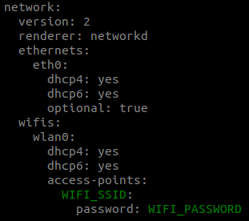
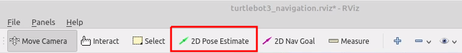
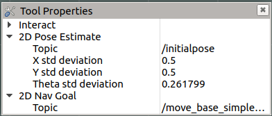

# Hack My Robot
###### System Instructions 

### Robot Preparation
1. Build your robot.
   * [Robotis eManual](https://emanual.robotis.com/docs/en/platform/turtlebot3/hardware_setup/#hardware-assembly)
   * [Youtube tutorial](https://www.youtube.com/watch?v=5D9S_tcenL4) 
2. Setup your PC.
   * [Robotis eManual](https://emanual.robotis.com/docs/en/platform/turtlebot3/sbc_setup/#sbc-setup)
   * Download and install Ubuntu on your PC (Remote PC). The recommended setup is Ubuntu 20.04 and ROS Noetic. You're free to install everything on a virtual machine, but performance wise it's going to be better if you partition your disk. 
   * Install dependent ROS packages and TurtleBot3 packages.
   * Clone this repository on your ```catkin_ws/src``` directory and build it. (You can also clone and run this node on the TurtleBot3, but performance wise we recommend you run it on your Remote PC)
   ```
   cd catkin_ws
   catkin_make
   ```
3. Setup TurtleBot SBC.
   * Either follow [Robotis eManual](https://emanual.robotis.com/docs/en/platform/turtlebot3/sbc_setup/#sbc-setup) to flash their ROS image and set up the TurtleBot.
   * Or flash the micro SD card with the provided [.img file](https://drive.google.com/file/d/18IKNXmm-hT8XVjJUEMNhZLNY1hveEXTp/view?usp=sharing) from the HMR organisers. This image is built based on the one provided by Robotis in their tutorial, and you can achieve the same results by following the full tutorial.
   * Configure the WiFi Network Settings
      -  Open a terminal window and go to the ```/etc/netplan``` directory in the microSD card.
      - Edit the 50-cloud-init.yaml file to modify your WIFI_SSID and your WIFI_PASSWORD. 
        ```
        sudo nano 50-cloud-init.yaml
        ```
        
   * Plug the microSD card back into the turtlebot and boot it up. If all the steps were done correctly, the turtlebot should now be connected to your WiFi network and you can connect through ssh (username:ubuntu / password:turtlebot).
        ```
        ssh ubuntu@IP_ADDRESS_OF_TURTLEBOT3
        ``` 
4. ROS Network configuration.
   * Adjust the parameters according to the IP addresses of your devices.
   * Remote PC.
      - Add the following two lines to your ~/.bashrc file
         - ROS_MASTER_URI=http://localhost:11311
         - ROS_IP={IP_ADDRESS_OF_REMOTE_PC}
      - Include the IP address and hostname of the TurtleBot3 in your ```/etc/hosts``` file (if you don't do this, you might have issues communicating with the TurtleBot3 later on).
  
   * TurtleBot3 SBC. 
      - Add the following two lines to your ~/.bashrc file
         - ROS_MASTER_URI=http://{IP_ADDRESS_OF_REMOTE_PC}:11311
         - ROS_IP={IP_ADDRESS_OF_TURTLEBOT3}
      - Include the IP address and hostname of your Remote PC in the TurtleBot3 ```/etc/hosts``` file (if you don't do this, you might have issues communicating with the TurtleBot3 later on).
  
5. Test your configuration.
   * Bringup your robot by following the [Robotis eManual](https://emanual.robotis.com/docs/en/platform/turtlebot3/bringup/#bringup).
   * Test the [keyboard teleoperation](https://emanual.robotis.com/docs/en/platform/turtlebot3/basic_operation/) from your Remote PC to check if all the network configuration parameters have been properly set. If the robot is not moving, you probably need to recheck all the network parameters, double check that the /etc/hosts file in the TurtleBot3 contains a reference to your Remote PC.  

### Mapping the scenario
For further detailed information please refer to the [Robotis eManual](https://emanual.robotis.com/docs/en/platform/turtlebot3/slam/#run-slam-node).

1. ```roscore``` on Remote PC.
2. Bringup of the robot on the TurtleBot3 if not running already. 
```
roslaunch turtlebot3_bringup turtlebot3_robot.launch
```
3. Use the SLAM algorithm to map the scenario. It doesn't need to be too big, just focus on the area you are going to work with, around 1.5mx1.5m. 
```
roslaunch turtlebot3_slam turtlebot3_slam.launch
```
4. Use the keyboard teleoperation to drive your robot around, until you are satisfied with the mapped environment.
```
roslaunch turtlebot3_teleop turtlebot3_teleop_key.launch
```
5. Save your map. You can use the *-f* option in order to specify a folder location and a file name. 
```
rosrun map_server map_saver -f ~/map
```
6. Kill the SLAM node with Ctrl+C

### Launch the Hack My Robot routine

The launch file located in ```hack_my_robot/launch/hack_my_robot_complete.launch``` already launches the navigation node, the image_saver node and the hack_my_robot main routine node. Refer to the [Robotis eManual](https://emanual.robotis.com/docs/en/platform/turtlebot3/navigation/#run-navigation-nodes) for further information regarding the navigation stack. 

1. Edit the launch file to suit your parameters.
   * Map name and location for the navigation node.
   * Any other parameter you might have modified (although we don't recommend that).  
2. Launch the file. 
```
roslaunch hack_my_robot hack_my_robot_complete.launch
```
3. Setup your initial position.

4. Launch the keyboard teleoperation node in order to move your robot around so it can locate iself on the map (just spinning around should be enough).
5. Once the robot has located itself, we need to change the functionality of the 2D Pose Estimate button. We will use the same tool in order to provide our robot the 3 waypoints needed for the Hack My Robot main routine. 
   * Go to the Panels dropdown menu and make the "Tools Properties" panel active.
   * Change the topic of the 2D Pose Estimate tool from */initialpose* to */addpose*
     
   * Close the panel. 
6. Indicate 3 positions in the map using the 2D Pose Estimate tool, in the same way as you indicated the initial position of the robot in Step 3. A small green arrow should appear where you indicated the position, and a message should appear on the terminal where you launched the ```hack_my_robot_complete.launch file```. 
7. Publish an empty message to the path_ready topic to run the routine once and save the positions in a file. 
```
rostopic pub -1 /path_ready std_msgs/Empty
```
8. Wait until it finishes the routine. If all went well, the robot should have "EXCAVATED" in the 3 locations you previously set. 
9. If you are happy with the routine, publish an empty message to the start_journey topic to start a loop. The routine will stop as soon as you stop publishing the message to the topic. 
```
rostopic pub /start_journey std_msgs/Empty
```
10.  Let's get hacking!!

### Final Round Evaluation Criteria and Guidelines
The criteria are aligned with the first-round questions, and the teams are expected to implement some of the ideas they provided in response to the related questions. Moreover, the given criteria aim to evaluate the teams’ ability to reach the goals of the competition while being creative and original. The teams will be ranked based on the total points collected from all the items listed below.

The scenario and hints, evaluation criteria, and other guidelines for the final round are as follows:

#### The Scenario and Hints
The Turtlebot used in this competition represents an autonomous excavator that follows an excavation routine on a construction site. The routine has four predefined waypoints, which are the excavation locations. The amount and depth of the excavation are directly proportional to the duration that the robot waits at each waypoint. The operator, Bob, is in charge of monitoring the operation of the autonomous excavator to make sure that everything works as planned. Bob has an office on the construction site, near the excavator’s working area, where he has his computer to monitor the operation. He set up a network in his office using a wireless router to communicate with the excavator. His computer is connected to the wireless router via an ethernet cable, and the robot is connected to the router through a wireless connection (5GHz). The IT department of the project informed Bob that his Wi-Fi password is among the most common passwords; however, he did not want to change it, thinking that no one would try to connect it anyway. Bob’s computer also has password protection, and Bob chose a password that combines several personal elements to memorize it more easily (a list of possible personal elements will be provided at the beginning of the final round). Bob connects to the robot to give commands and receive data via secure shell (SSH). Bob saved his SSH credentials in a file on his computer; however, he found a way to make it more secure (the file will have a hint about it).
#### Evaluation Criteria and Scores
#### 1.	Is the team able to find different passwords required for having access to the robot?
The Wi-Fi password will be announced 20 minutes after the competition starts, and it will also be provided to any team that requests it before 20 minutes. The teams that can find the correct Wi-Fi password within the first 20 minutes of the competition will receive points for the first item of this criterion. The team will collect points if they can achieve the following:

  1.1) The team could find the Wi-Fi password within the first 20 minutes **(10 Points)**  
  
  1.2) The team could social engineer the external computer’s password **(10 Points)** 
  
  1.3) The team could find the login credentials for the robot **(5 Points)**
  
#### 2.	Is the team able to acquire/access the sensitive file stored in the robot? (Yes/No) (10 Points/0 Points)

This criterion includes only accessing the sensitive file stored in the robot. The teams are expected to implement some of the ideas they provided in response to Question 1 in the first round. (In the context of this competition, the sensitive file corresponds to a design file (.ifc format) that has information regarding the constructed building.)

#### 3.	Is the team able to alter the predefined path the robot should follow?

Turtlebots utilize obstacle avoidance, using the on-board LiDAR sensor to be aware of their surroundings. The LiDAR sensor is located approximately at 20 cm height. The height of the human object is 15 cm, and the height of the cement silo object is 25 cm. The teams are expected to implement some of the ideas they provided in response to Question 2 in the first round. The team will collect points if they can achieve either one of the following:

  3.1) Make the robot follow a path different than the predefined one but not hitting any objects (Yes/No) **(10 points/0 points)**
  
  3.2) Change the robot’s path to hit the human object at the arena (Yes/No) **(15 points/0 points)**
  
  3.3) Change the robot’s path to hit the cement silo object at the arena (Yes/No) **(20 points/0 points)**
  
#### 4.	Is the team able to increase the predefined duration that the robot is supposed to stay at each waypoint of the routine? (Yes/No) (10 Points/0 Points)

The duration that the robot waits at each waypoint is considered to be related to the amount and depth of the excavation that the autonomous excavator performs in the context of this competition’s scenario. Therefore, the increased duration of the robot’s waiting time is considered a deeper than planned excavation, which can cause issues such as damaging the underlying infrastructure (e.g., power cables, drainage pipes). The teams are expected to implement some of the ideas they provided in response to Question 2 in the first round.

#### 5.	Is the team able to compromise the availability of the robot? 

The team will collect points if they can reduce the robot’s performance, cause interruptions in resource availability, or cause a total loss of availability. Please refer to the “2.3.3. Availability (A)” section of the [Common Vulnerability Scoring System (CVSS) v3.1 specification document](https://www.first.org/cvss/v3-1/cvss-v31-specification_r1.pdf) to see different levels of impact on availability. Different possible points based on the performance of the team are as follows:

  5.1) No impact on availability **(0 Points)**
  
  5.2) Low impact on availability **(7 Points)**
  
  Performance is reduced, or there are interruptions in resource availability. 
  
  5.3) High impact on availability **(10 Points)**
  
  Total loss of availability, which results in full denial of access to resources.
  
#### 6.	Technical difficulty/sophistication of the utilized techniques (0-15 points)

The judges will evaluate the teams based on the complexity and sophistication of the methods they used during the final round. Please refer to the “2.1.2. Attack Complexity (AC)” section of the [Common Vulnerability Scoring System (CVSS) v3.1 specification document](https://www.first.org/cvss/v3-1/cvss-v31-specification_r1.pdf) to see what is expected in terms of complexity.

#### 7.	Creativity (*wow* factor) (0-10 points)

This criterion aims to evaluate the team’s ability to think “out of the box”. The teams will collect points for this criterion if they can develop original ideas to tackle the challenges mentioned in the previous criteria.

#### 8.	Other/bonus points (up to 15 points)

**Note:** The teams will have physical access to the robots; however, if they achieve the goals by utilizing physical attacks, they will receive half of the standard points. See the “2.1.1. Attack Vector (AV)” and "7.4. Metric Values" sections of the [Common Vulnerability Scoring System (CVSS) v3.1 specification document](https://www.first.org/cvss/v3-1/cvss-v31-specification_r1.pdf) for the justification.

#### Final Round Rules and Timeline

  1.	All teams should bring their laptops and any additional equipment required to the final round to perform their attacks.
  2.	The teams can get support from ChatGPT during the final round; however, they need to acknowledge their use. Therefore, the teams that use ChatGPT need to submit the full prompts and answers history from ChatGPT to the judges at the end of the competition. 
  3.	The teams will have physical access to the robots if they request it; however, if they achieve the goals by utilizing physical attacks, they will receive half of the standard points for all the achieved goals that directly or indirectly depend on the physical access.
  4.	The teams will collect points only if they achieve the criteria intentionally. For example, if the robot gets disconnected from the network due to a technical problem, not because of an attack, the team will not receive any points for Criterion 5. If the robot hits one of the objects on the arena due to a technical issue, not because of the team’s modifications, the team will not receive any points for Criterion 3. 
  5.	During the competition, the teams should inform the judges or organizers to show their successful attacks immediately and replicate/demonstrate what they did (if requested) to collect points for different criteria. 
  6.	Each team will need to present a poster at the end of the final round. The template for the poster can be found [here](https://docs.google.com/presentation/d/1x-OmkGRheAjjI__kbQStaainIRyfAbNc/edit?usp=share_link&ouid=110937514079708301128&rtpof=true&sd=true). The teams need to send their posters to the organizers by the end of November 7. Each team will have 10 minutes to present/summarize what they did during the challenge (see the timeline in the item below). The poster presentation will be considered by the judges, too (e.g., in the Creativity / Bonus sections). The poster size is A0 (841 x 1189 mm). It can be printed by the organizers at NYUAD if needed. 
  7.	The final round will take place from 2 p.m. to 6 p.m. on November 10. The breakdown of this period is as follows:

    •	2:00 - 2:30 p.m. (30 mins) - Preparation / set up

    •	2:30 - 5:00 p.m. (2.5 hours) - Competition and judging
    
    •	5:00 - 6:00 p.m. (1 hour) - Poster presentations (10 mins per team) / judges' deliberations
    


